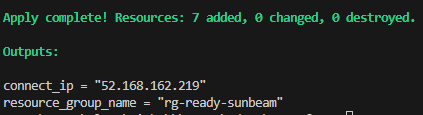
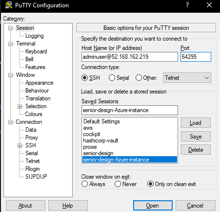

# Senior Design - Honey Badger - HoneyNet

## Problem Statement

For our Senior Design project, we sought out to build an automation framework for deploying a reusable, composble honeynet environment for three purposes
- Researching and Analyzing Current Threat Landscape
- Allowing for honeynet deployment in strategic network segments to find indictaors of compromise
- A disposble, sandbox environment for offensive security and red team use

## Project Roadmap

## Project Documentation

### Launching the Infrastructure

#### Dependencies

- Install Terraform and AzureCLI for Authentication and allow Terraform to manage resources in Azure through the CLI
  - Windows: `winget install Hashicorp.Terraform, Microsoft.AzureCLI` (automatically will add Terraform's CLI alias, make sure you restart your shell)
  - 
- Setup Azure Subscription @ portal.azure.com
  - Run `az login`
  - It should show your free Azure for Students subscription, enter 1 to select it

- Clone this repo, cd into the ./terraform directory, and run `terraform init`
  - This installs relevant API dependencies for you to use what is called a "provider" which for instance, can be Azure. If you were using AWS, there is another AWS provider for communicating with AWS APIs to spawn infrastructure. 

#### Generate a SSH Keypair and Set Environment Variable

- `ssh-keygen -t rsa -b 4096 -C "senior-design-ssh-key"`, can leave defaults blank or customize name of keypair
- 

- Always run a `terraform plan` before an apply. This gives you information about the deployment so you can ensure accuracy before running in blind.. This will show the resources that will get created within Azure, and it'll show you that everything is working and shouldn't error out. It will prompt you for your Public Key Variable path

- When you are ready, run `terraform apply` and answer yes to the prompt and wait for the resources to be provisioned. One of the outputs will be the public IP of the VM instance. Use that as well as your id_rsa private key to connect to it.

#### Connecting

- Convert the private key to a ppk using Puttygen.
- Use the following connection settings
  

- Make sure you select the ppk key under SSH --> Auth

### Understanding the composition of the project

This project is structured in three folders

- Scripts contains any bash scripts neccessary for initialzing the VM and installing ansible depencies
- Ansible Contains the playbook neccessary for  automating the install of tpot, Wireguard, and Docker
- Terraform contains the infrastructure as code required for deploying a templatized virtual machine into our Azure cloud environment.