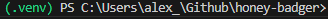

# Authentication Logger

The purpose of this docker container is to log all attempts of form input and to build an idea of what wordlists or injection attempts attackers may use.

## Autonomy 

This docker container spins up a python flask web application.

### To develop the application

1. Install python
   `winget install Python.Python.3.9`
2. I prefer to use virtual environments to manage python depenendencies on a per app basis, these steps are optional, but are preferred to isolate and keep your dependencies clean and non-conflicting

`py -m venv .venv` 

`Set-ExecutionPolicy Bypass -Scope Process`  (Temporily bypasses powershell script restricted to activate your python virtual env)

`.\.venv\Scripts\activate`

